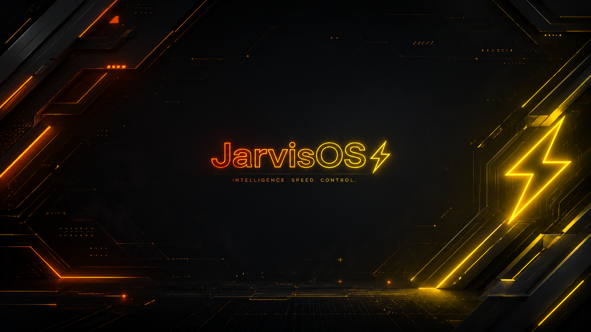
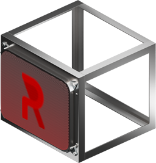
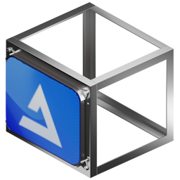
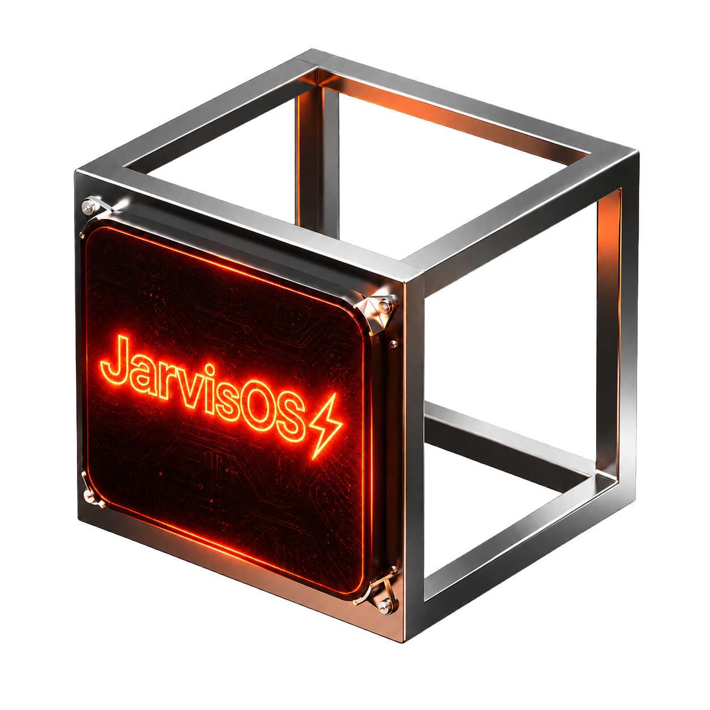

  
    
  <h1>JarvisOS⚡</h1>
  <table border="0" cellpadding="10" cellspacing="0">
    <tr align="center" valign="middle">
      <td> ReviOS</td>
      <td><b>➕</b></td>
      <td> AtlasOS</td>
      <td><b>➕</b></td>
      <td> Privacy+</td>
      <td><b>🟰</b></td>
      <td> <b>JarvisOS⚡</b></td>
    </tr>
  </table>
   
  
<strong>Beyond Gaming. Beyond Privacy. A Production-Grade Full-Stack Developer Workstation OS.</strong>

  
<em>Built by developers, engineered for builders, optimized for absolute performance and zero telemetry.</em>

  
  
  
  
  

---

## 🚀 Overview

**JarvisOS⚡** represents a paradigm shift in Windows modification. While traditional playbooks force you to choose between stripping the OS for gaming FPS or preserving features for development, JarvisOS merges the best of both worlds into a single, master-crafted baseline. 

By taking the extreme low-latency optimizations of **AtlasOS**, the core stability of **ReviOS**, and injecting the paranoia-level security of **Privacy Plus**, JarvisOS delivers the ultimate hybrid environment.

> **We abandoned the fragmented "Multi-Mode" approach. There are no gaming or creator modes here. JarvisOS is a singular, uncompromising Developer Workstation.**

---

## 🏗️ The Four Pillars of JarvisOS

### 1. ⚡ Developer-First Performance
Unlike gaming playbooks that break core Windows features to maximize frame rates, JarvisOS intentionally preserves critical developer infrastructure. You get the ultra-low latency and debloated speed of AtlasOS without sacrificing virtualized environments.
* **Native WSL2 & Hyper-V Support**
* **Windows Sandbox Preserved**
* **.NET & WinGet Fully Functional**

### 2. 🤖 AI & Next-Gen Tooling Base
The architecture heavily emphasizes modern AI development out-of-the-box. Instead of configuring environments from scratch, JarvisOS prompts you to install your stack during setup.
* **Ollama (Local LLMs) Integration**
* **CUDA Toolkits for GPU Processing**
* **Native VS Code, Python, & Node.js Deployment**

### 3. 🛡️ Enhanced Unix-Style Security
Gaming OS builds often blindly disable UAC and Defender, leaving systems vulnerable. JarvisOS introduces a "Unix-style sudo UAC" that requires password confirmation for privilege escalation.
* **Sudo UAC Escalation**
* **Offline Bitdefender Total Security Bundled**
* **Microsoft Defender & SmartScreen Completely Ripped Out**

### 4. 🥷 Absolute Privacy Plus
A "scorched-earth" approach to telemetry. We don't just use toggles; we physically delete Windows tracking binaries and block Microsoft telemetry endpoints at the firewall level.
* **Zero-Telemetry Firewall Isolation**
* **Microsoft Edge & Co-Pilot Hard-Removal**
* **Deep Debloat of all UWP Bloatware**

---

## 🧰 The Unified Toolbox

JarvisOS integrates disparate tools from its ancestor playbooks into a single, centralized control center accessible directly from the Start menu:

**Atlas Desktop Tools + Revision Tool + Privacy+ Settings = `JarvisOS Tools`**

---

## ✨ Interactive AME Wizard Features

JarvisOS features a stunning, interactive installation UI within the AME Wizard:

* **🌐 Multi-Browser Selection** — Brave, LibreWolf, Zen Browser, BrowserOS.
* **💻 Dev Tooling** — Auto-install Git, VS Code, Node.js, Python 3, PowerShell 7, Windows Terminal.
* **🔧 Deep Configuration** — Configure CPU Mitigations, Update Logic, and Core Mappings directly in the UI.

---

## 📦 Installation Guide

1. **Download AME Wizard** — Get the latest [AME Wizard Beta](https://ameliorated.io/)
2. **Prepare ISO** — Use AME Wizard's ISO Injection for the cleanest results.
3. **Load Playbook** — Drag and drop the `JarvisOS` `.apbx` file into the AME Wizard.
4. **Configure Setup** — Walk through the JarvisOS interactive setup screens to tailor your workstation.
5. **Reboot** — Your optimized, zero-telemetry Developer OS is ready.

---

## ⚠️ Important Notices

* **Offline Account Only** — JarvisOS enforces offline local accounts. Microsoft Accounts will not function.
* **OEM Drivers** — Install proprietary drivers (GPU, Motherboard) *before* applying the playbook.
* **Windows Update** — The update engine is fully suspended to prevent Microsoft from reverting privacy tweaks.

---

## 🙏 Credits

JarvisOS⚡ is built with precision for builders by **PsProsen-Dev**.

Inspired by and built upon the legendary foundations of: 
[ReviOS](https://revi.cc/) · [AtlasOS](https://atlasos.net/) · [Privacy+](https://github.com/aspect-build/privacy-plus)

---

  <em>"The ultimate workstation OS. Engineered without compromise."</em>

